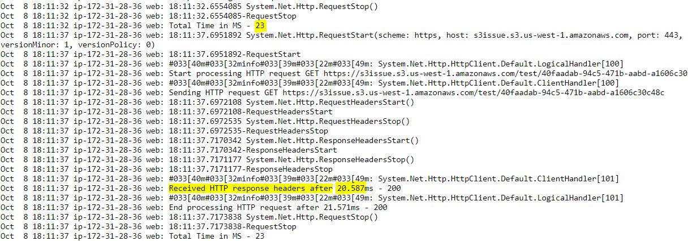
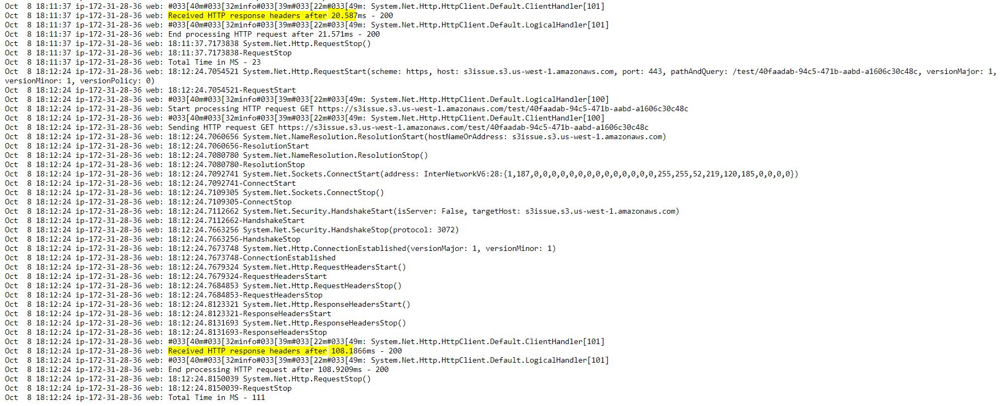

# S3HttpClientApi

## Isssue : S3 Response time is higher.
We created application which will retrieve S3 file parallelly from S3 bucket. While performance testing, we found below for single file fetch.
* When we call API frequntly in loop (without delay), it will return result in 20-30ms.
    * We obvserve that when it return response in 20-30ms HttpSocket is open.
    * Request skip DNS lookup and socket handshaking steps.
     
* When we call API randomly (without loop) within 10 seconds, result will be either of below
    1. 30ms-80ms mostly.
    1. 100+ms sometimes
    
* When we call API with interval of more then 10-20 seconds S3 will take 100ms to 200ms to send response back.

Please check image/logs for more information.

## HttpClinet VS S3 Logs

We also check with S3 logs and found that it send response in 20ms to 80ms but in actual scenario it take time. 

Http Log | S3
:--------:|:----:
113|72
102|88
53|41
123|67
49|37
23|19
|||

Please check Log\S3AndHttpLog for log files.

## We try below solutions but not found any improvement

    1. S3 Client with standard configuration.
    2. Implement DotNet HttpClient Factory and set it in S3 configuration.
    3. Implement Custom HttpClient Factory and set it in S3 configuration.

* Please check code for more information. Search for Case-1, Case-2 and Case-3 for above 3 solution.

## Logs
* We added HttpEventListener to check timing of each and every activity of http call.
* Please find complete logs in log folder.

    1. Result in 53ms - With socket connection and HttpHandShake.
    

    2. Result in 20ms - Reuse socket connection
    

    3. Result in 108ms - With socket connection and HttpHandShake, S3 take time to respond.
    

## Conclusion
* From image 1,2 and 3
    1. S3 SDK not reuse socket connection and close it. (53ms)
    2. If we fetch data in loop without delay then only it will reuse socket connection. (20ms)    
    3. S3 take time to respond and hence fetch time is more then 100ms. 

## Configuration
* AWS EC2 Instance	: t3a.micro
* Configuration: 2 vCPU, 1 GB RAM, Network Bandwidth - Up to 5 Gigabit
* Region: us-west-1
* Application : .Net Core 5
* File Size : 345 Byte
* S3 Bucket and EC2 instance are in same region
* Created VPC between S3 Bucket and EC2 instnace

## Expected Behaviour
* S3 SDK have to manage socket connection and reuse it so that it will return data withing 20-30ms.
* In any case S3 server must send response withing 100ms.

## Current Behaviour
* S3 SDK not mangage HttpClient properly, it close socket connection and not reuse. For each request it perform DNS lookup and Http Handshaking. 
* S3 Server take 100+ms for response.
